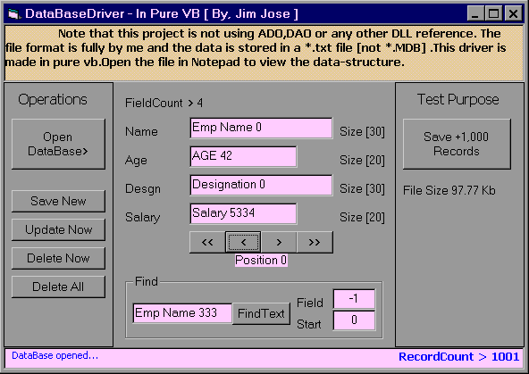



## \[ Build DataBase In Text File \] \- Pure VB

### Description

A fast DataBase driver without ADO, DAO reference, in pure vb. It is not using any third party product. The Data is stored in a standard text file, in the most simple format. The driver is made in Class as well as ActiveX Control. Most of the basic functions are included. You can view the data structure by opening the file in Notepad. You are free to use it and give me your feedback. Good Luck!
 
### More Info
 

             |
---                |---
**Submitted On**   |2004-01-21 12:04:38
**By**             |[JJJJJJJJ](https://github.com/Planet-Source-Code/PSCIndex/blob/master/ByAuthor/jjjjjjjj.md)
**Level**          |Intermediate
**User Rating**    |4.7 (227 globes from 48 users)
**Compatibility**  |VB 6\.0
**Category**       |[Files/ File Controls/ Input/ Output](https://github.com/Planet-Source-Code/PSCIndex/blob/master/ByCategory/files-file-controls-input-output__1-3.md)
**World**          |[Visual Basic](https://github.com/Planet-Source-Code/PSCIndex/blob/master/ByWorld/visual-basic.md)
**Archive File**   |[\[\_Build\_Da1888965172005\.zip](https://github.com/Planet-Source-Code/jjjjjjjj-build-database-in-text-file-pure-vb__1-60559/archive/master.zip)

